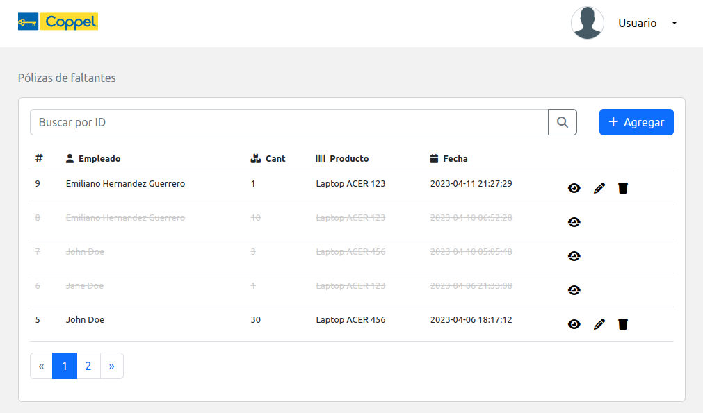
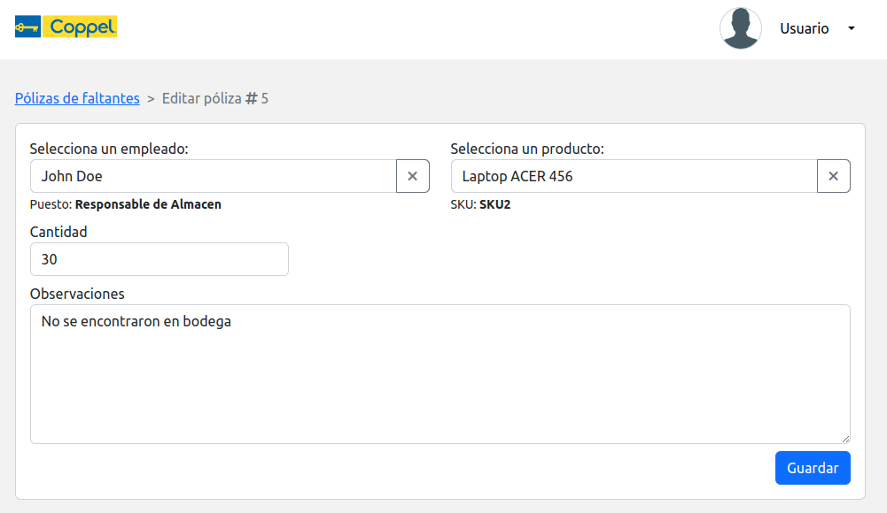

# Prueba técnica CRUD de pólizas de faltantes

## ¿Qué es una póliza de faltante?
Una póliza de faltante es un documento utilizado en el contexto del manejo de inventarios que se genera cuando se detecta una discrepancia entre la cantidad de un producto registrada en el sistema y la cantidad real en el inventario físico. Por tanto, la póliza de faltante se utiliza para registrar la cantidad de productos que faltan en el inventario y, probablemente, el motivo por el cual ocurrió la discrepancia.

Motivos de ejemplo:

- puede ser que se hayan vendido productos sin que se haya registrado la transacción
- pudo haber habido un error en la recepción o el conteo de los productos

## Pantallas

### Pantalla de inicio de sesión

### Pantalla de listado de pólizas

### Formulario de póliza

## Diagrama de base de datos

[Ver en dbdiagram.io](https://dbdiagram.io/d/6435f6f88615191cfa8d27ae)

## Diagramas de secuencia

### Autenticación
- [Login](docs/diagramas-de-secuencia/auth-login.md)
- [Register](docs/diagramas-de-secuencia/auth-register.md)

### Pólizas
- [Listar](docs/diagramas-de-secuencia/polizas-list.md)
- [Registrar](docs/diagramas-de-secuencia/polizas-create.md)
- [Actualizar](docs/diagramas-de-secuencia/polizas-update.md)
- [Eliminar](docs/diagramas-de-secuencia/polizas-delete.md)